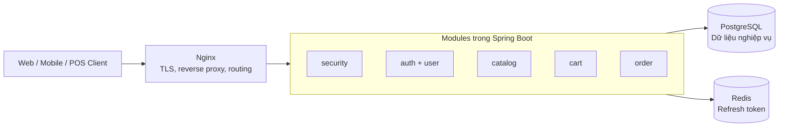
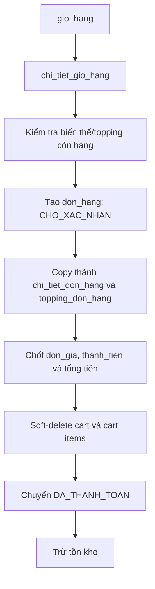

# Kiến trúc MilkTea POS & Omnichannel Ordering — Phase 1 đến 5

Tài liệu này mô tả kiến trúc và nghiệp vụ hiện có của backend Spring Boot, gồm các phase: Auth, User, Catalog, Cart và Order.

## 1. Tổng quan kiến trúc

### 1.1. Modular Monolith là gì?

Hệ thống là một **Modular Monolith**: toàn bộ backend chạy trong một ứng dụng Spring Boot và được triển khai như một service, nhưng mã nguồn được chia theo domain nghiệp vụ:

- `auth`: xác thực và phiên đăng nhập.
- `user`: người dùng và vai trò.
- `catalog`: thực đơn và tồn kho món/topping.
- `cart`: giỏ hàng.
- `order`: đơn hàng và vòng đời bán hàng.

Mỗi module có controller, service, repository, entity và DTO riêng. Các module gọi nhau trực tiếp trong cùng process và dùng chung PostgreSQL.

| Mô hình | Đặc điểm | Phù hợp với dự án hiện tại? |
|---|---|---|
| Monolith truyền thống | Một codebase nhưng thường trộn domain và tầng kỹ thuật, khó mở rộng khi lớn. | Không tối ưu về khả năng bảo trì. |
| Modular Monolith | Một service, nhưng ranh giới module rõ ràng; transaction và debug đơn giản. | Có — phù hợp khi đang phát triển nhanh từ Phase 1–5. |
| Microservices | Mỗi domain là service độc lập; phải xử lý network, observability, distributed transaction, deployment nhiều service. | Chưa cần thiết ở giai đoạn hiện tại. |

Lý do chọn Modular Monolith:

1. Nghiệp vụ Order, Cart, Catalog cần transaction đồng nhất; dùng chung process/database đơn giản và an toàn hơn ở giai đoạn đầu.
2. Đội ngũ nhỏ dễ chạy, debug, test và deploy.
3. Code vẫn được tách theo domain để tương lai có thể tách `order` hoặc `catalog` thành service riêng khi cần.

### 1.2. Sơ đồ triển khai

> `docker-compose.yml` hiện có Spring Boot, PostgreSQL và Redis. Nginx là reverse proxy nên được đặt trước backend khi triển khai production.



### 1.3. Luồng xử lý request

Ví dụ request `POST /api/orders`:

```text
Client
  → Nginx
  → Spring Security / JwtFilter
  → OrderController
  → OrderServiceImpl (@Transactional)
  → Repository / JPA
  → PostgreSQL
  → ApiResponse<OrderResponse>
```

Chi tiết:

1. Client gửi HTTP request; có thể có `Authorization: Bearer <JWT>` và `X-Cart-Token`.
2. Nginx chuyển tiếp request vào Spring Boot.
3. `JwtFilter` đọc JWT, kiểm tra người dùng còn hoạt động và tạo `UserPrincipal` trong `SecurityContext`.
4. Spring Security kiểm tra endpoint đó có public hay cần đăng nhập/quyền phù hợp.
5. Controller nhận DTO, chạy validation (`@Valid`) rồi gọi service.
6. Service thực thi quy tắc nghiệp vụ, đọc/ghi dữ liệu qua repository trong transaction.
7. Repository/JPA phát sinh SQL đến PostgreSQL.
8. Controller trả `ApiResponse<T>`. `GlobalExceptionHandler` chuyển exception thành response lỗi thống nhất.

## 2. Ý nghĩa nghiệp vụ của từng module

### 2.1. `common`

**Bài toán kinh doanh:** Chuẩn hóa API và lỗi để POS, app và website luôn nhận cùng một cấu trúc response.

**Dữ liệu quản lý:** Không sở hữu bảng riêng. `BaseEntity` được các entity dùng chung với `created_at`, `updated_at`, `deleted_at`.

**Kỹ thuật chính:**

- `ApiResponse<T>`: response wrapper thống nhất.
- `GlobalExceptionHandler`: tập trung xử lý validation, lỗi nghiệp vụ và optimistic locking.
- `BusinessException`: biểu diễn lỗi nghiệp vụ có HTTP status rõ ràng.
- Soft delete: `markDeleted()` gán `deleted_at`, giúp giữ lịch sử thay vì xóa cứng.

### 2.2. `config`

**Bài toán kinh doanh:** Cấu hình các năng lực nền tảng dùng chung: bảo mật, tài liệu API và Redis.

**Dữ liệu quản lý:** Không có bảng riêng. Redis lưu refresh token với key dạng `auth:refresh:<token>`.

**Kỹ thuật chính:**

- `SecurityConfig`: cấu hình stateless security, endpoint public và JWT filter chain.
- `OpenApiConfig`: Swagger/OpenAPI để frontend hoặc POS tra cứu API.
- Spring Boot Redis auto-configuration: kết nối Redis qua `spring.data.redis`.

### 2.3. `security`

**Bài toán kinh doanh:** Nhận diện người gọi API và kiểm soát quyền như ADMIN, MANAGER, CASHIER, BARISTA, CUSTOMER.

**Dữ liệu quản lý:** Đọc từ `nguoi_dung` và `vai_tro`; không có bảng riêng.

**Kỹ thuật chính:**

- JWT stateless: server không giữ session access token.
- `JwtFilter` kế thừa `OncePerRequestFilter`: chạy một lần trên mỗi request.
- `UserPrincipal`: đối tượng danh tính hiện tại, gồm id, username, role.
- RBAC: quyền endpoint qua Spring Security và `@PreAuthorize`.

### 2.4. `auth`

**Bài toán kinh doanh:** Cho phép khách hàng đăng ký/đăng nhập, nhân viên đăng nhập, cấp lại phiên bằng refresh token và logout.

**Dữ liệu quản lý:** `nguoi_dung`, `vai_tro`; refresh token được lưu Redis thay vì bảng database.

**Kỹ thuật chính:**

- BCrypt mã hóa mật khẩu.
- Access token ngắn hạn và refresh token dài hạn.
- Token rotation: khi refresh, token cũ bị xóa trong Redis trước khi cấp token mới.
- Kiểm tra người dùng đang hoạt động khi login và khi `JwtFilter` xác thực request.

### 2.5. `user`

**Bài toán kinh doanh:** Quản lý tài khoản nhân viên/khách và vai trò phục vụ phân quyền trong quán.

**Dữ liệu quản lý:**

- `nguoi_dung`: tên đăng nhập, mật khẩu mã hóa, họ tên, số điện thoại, trạng thái hoạt động.
- `vai_tro`: ADMIN, MANAGER, CASHIER, BARISTA, CUSTOMER.

**Kỹ thuật chính:**

- Repository pattern qua Spring Data JPA.
- Quan hệ `ManyToOne`: nhiều người dùng thuộc một vai trò.
- RBAC và soft delete/audit từ `BaseEntity`.

### 2.6. `catalog`

**Bài toán kinh doanh:** Quản lý thực đơn, size, giá bán và tồn kho để quán chỉ bán những món/topping còn hàng.

**Dữ liệu quản lý:**

- `loai_san_pham`: ví dụ Trà sữa, Trà trái cây.
- `san_pham`: ví dụ Trà sữa truyền thống.
- `bien_the_san_pham`: biến thể của món, ví dụ size M hoặc L; có `gia_ban`, `so_luong_ton`, `con_hang`.
- `topping`: ví dụ trân châu đen, pudding; có giá và tồn kho.

**Kỹ thuật chính:**

- DTO + Mapper: tách API contract khỏi JPA entity.
- Service/Repository pattern, pagination và tìm kiếm sản phẩm.
- Validation và phân quyền chỉnh menu cho ADMIN/MANAGER.
- Optimistic locking qua `@Version` trên `bien_the_san_pham` và `topping`.

### 2.7. `cart`

**Bài toán kinh doanh:** Cho khách chọn món, size, đường/đá/topping trước khi tạo đơn; hỗ trợ cả khách vãng lai lẫn thành viên.

**Dữ liệu quản lý:**

- `gio_hang`: gắn với `ma_khach_hang` hoặc `token_phien`.
- `chi_tiet_gio_hang`: biến thể, số lượng, đường, đá, ghi chú và thành tiền.
- `topping_gio_hang`: topping đã chọn cho một dòng giỏ.

**Kỹ thuật chính:**

- Guest cart được nhận diện bằng UUID trong header `X-Cart-Token`.
- Member cart được gắn với `khach_hang`.
- Cart merge: khi khách đăng nhập, các item của guest cart được chuyển sang member cart và guest cart được soft-delete.
- Tính giá ở server để không tin giá do client gửi lên.
- Kiểm tra món/topping còn hàng khi thêm hoặc sửa item.

## 3. Module `order`: trung tâm của hệ thống

### 3.1. Vì sao `order` là trái tim hệ thống?

Order kết nối các domain quan trọng nhất trong quy trình bán hàng:

- Nhận đơn từ POS, QR tại bàn, app và website.
- Liên kết khách hàng, thu ngân, ca làm việc và bàn.
- Chuyển menu/topping thành chứng từ bán hàng bất biến về giá.
- Kiểm soát trạng thái pha chế và thanh toán.
- Trừ hoặc hoàn tồn kho.

Các bảng chính gồm `don_hang`, `chi_tiet_don_hang`, `topping_don_hang`, cùng các liên kết `ca_lam_viec`, `ban`, `khach_hang`.

### 3.2. Luồng tạo đơn từ giỏ hàng



Khi tạo đơn từ giỏ, `OrderServiceImpl.create()` thực hiện:

1. Xác định giỏ bằng `cartToken`, hoặc giỏ của customer đã đăng nhập.
2. Từ chối giỏ rỗng và kiểm tra biến thể/topping còn đủ tồn.
3. Tạo `don_hang` với mã hiển thị như `DH-2026-001`, trạng thái đầu `CHO_XAC_NHAN`.
4. Copy mỗi `chi_tiet_gio_hang` thành `chi_tiet_don_hang`; topping tương ứng thành `topping_don_hang`.
5. Chốt `don_gia` và `thanh_tien`, sau đó tính `tong_tien_hang` và `tong_tien_thanh_toan`.
6. Soft-delete giỏ và các item/topping đã chuyển thành đơn.

Ví dụ khách mua 2 ly biến thể size L trong bảng `bien_the_san_pham`, giá 45.000đ, thêm trân châu 10.000đ/ly:

```text
chi_tiet_don_hang.don_gia       = 45.000
topping_don_hang.don_gia        = 10.000
chi_tiet_don_hang.thanh_tien    = 2 × (45.000 + 10.000) = 110.000
```

Đây là **snapshot giá**: lịch sử đơn giữ giá đã bán, ngay cả khi giá menu thay đổi sau đó. Hiện code chốt giá, số lượng và tùy chọn; tên sản phẩm vẫn được đọc qua quan hệ biến thể/sản phẩm.

### 3.3. State machine của đơn hàng

```text
CHO_XAC_NHAN
 ├─→ DA_THANH_TOAN ─→ DANG_PHA_CHE ─→ SAN_SANG ─→ HOAN_THANH
 └─→ DA_HUY

DA_THANH_TOAN / DANG_PHA_CHE / SAN_SANG ─→ DA_HUY
```

Hàm `transition()` chỉ cho phép các chuyển đổi hợp lệ. Ví dụ, không được nhảy trực tiếp từ `CHO_XAC_NHAN` sang `SAN_SANG`.

Tồn kho **không bị trừ khi chỉ mới tạo đơn**. Nó chỉ bị trừ khi chuyển sang `DA_THANH_TOAN`. Nếu đơn bị hủy sau khi đã trừ tồn, hệ thống hoàn tồn. Cờ `don_hang.ton_kho_da_tru` ngăn việc trừ hoặc hoàn lặp.

### 3.4. Concurrency: Counter DB và Optimistic Locking

#### Counter DB cho mã đơn

`order_sequence` chứa `nam` và `last_value`. `OrderNumberSequenceRepository` sử dụng SQL atomic:

```sql
INSERT INTO order_sequence(nam, last_value) VALUES (?, 1)
ON CONFLICT (nam)
DO UPDATE SET last_value = order_sequence.last_value + 1
RETURNING last_value
```

Do database thực hiện tăng số trong một thao tác atomic, hai cashier tạo đơn cùng lúc vẫn nhận mã khác nhau. Cách này tránh lỗi thường gặp của `SELECT MAX(...) + 1`.

#### Optimistic Locking cho tồn kho

Hai bảng `bien_the_san_pham` và `topping` có cột `version`, được ánh xạ bởi `@Version`.

Ví dụ chỉ còn một ly size L nhưng hai cashier cùng thanh toán:

1. Cả hai request có thể cùng đọc tồn kho là 1.
2. Request commit trước cập nhật tồn kho và tăng `version`.
3. Request còn lại cập nhật với version cũ sẽ thất bại.
4. `GlobalExceptionHandler` trả HTTP `409 Conflict`: “Dữ liệu tồn kho vừa được cập nhật; vui lòng thử lại”.

Kết quả: giảm nguy cơ bán vượt tồn kho mà không cần giữ database lock dài trong toàn bộ thao tác bán hàng.
